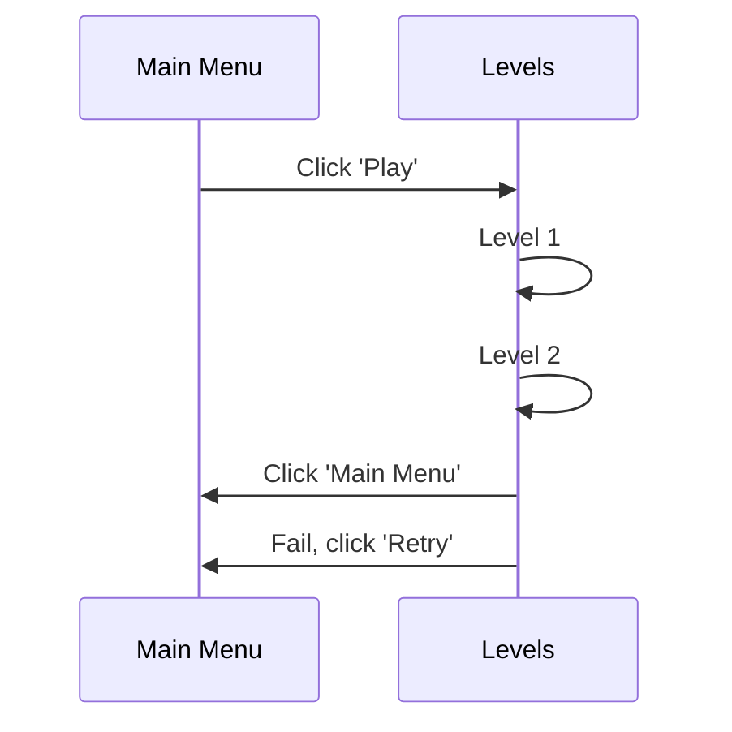

# Mind Swipe Web

[My Notes](notes.md)

This is an attempt to recreate the game called **"Mind Swipe"** and can have several levels of complexity. These will include following simple directions, matching colors, decoding a phrase of words, and doing all of this quickly to meet the time limit.

## 🚀 Specification Deliverable

For this deliverable I did the following. I checked the box `[x]` and added a description for things I completed.

- [x] Proper use of Markdown
- [x] A concise and compelling elevator pitch
- [x] Description of key features
- [x] Description of how you will use each technology
- [x] One or more rough sketches of your application. Images must be embedded in this file using Markdown image references.

### Elevator pitch

Have you felt like there's no new ideas? Like every game you find is another remake? Mind Swipe Web is here to help you with that! As a simple and fun game, Mind Swipe Web consists of matching simple code phrases with corners of your screen and passing each level.

### Design

A diagram of the main menu and the levels state.

### Key features

- Pressing the arrow keys will be how you interact with this game, whether you follow the directions or not!
- The main menu will have a 'Play' option
- The levels screen will have an option to return to the 'Main Menu'
- While on the levels screen if you get one wrong you will be shown a screen that says 'Retry'

### Technologies

I am going to use the required technologies in the following ways.

- **HTML** - html will give me the basic blocks, the buttons, the screens, and the score
- **CSS** - css will help me change the color of each side of the screen and the word each time
- **React** - display and update the score - maybe lives too
- **Service** - retrieving the high score, display a new xkcd comic each new high score (xkcd API)
- **DB/Login** - stores the high score and the set of prompts for each level
- **WebSocket** - updating the overall high score (below player high score)

## 🚀 AWS deliverable

For this deliverable I did the following. I checked the box `[x]` and added a description for things I completed.

- [x] **Server deployed and accessible with custom domain name** - [My server link](https://mindboggle.org).

## 🚀 HTML deliverable

For this deliverable I did the following. I checked the box `[x]` and added a description for things I completed.

- [x] **HTML pages** - It's all on the home page because of the simplistic design, but if it gets messy I'll have a how to play page separate
- [x] **Proper HTML element usage** - includes a header at the top, nav and main inside the body, and a footer at the bottom with my name and a link to GitHub
- [x] **Links** - Links are commented out, but can be added for the how to play page if needed
- [x] **Text** - Currently placeholders for fancy CSS elements that I'll add on the next deliverable
- [x] **3rd party API placeholder** - Will display a new comic using an API whenever you have a new best score
- [x] **Images** - I included an image of what the diagramed game will look like
- [x] **Login placeholder** - Will be on top of the game to be able to access and play
- [x] **DB data placeholder** - Will hold a list of the top scores
- [x] **WebSocket placeholder** - The score will update automatically and notify when you're breaking a new highscore

## 🚀 CSS deliverable

For this deliverable I did the following. I checked the box `[x]` and added a description for things I completed.

- [x] **Header, footer, and main content body** - I styled the header, footer, and main content and included it as a separate CSS file in each html page
- [x] **Navigation elements** - The nav elements are styled and consistent as part of the header
- [x] **Responsive to window resizing** - It resizes decently to different sizes of window
- [x] **Application elements** - The elements look like they should in the game
- [x] **Application text content** - The text isn't too big or too small when sceen sizes change
- [x] **Application images** - none needed!
## 🚀 React part 1: Routing deliverable

For this deliverable I did the following. I checked the box `[x]` and added a description for things I completed.

- [ ] **Bundled using Vite** - I did not complete this part of the deliverable.
- [ ] **Components** - I did not complete this part of the deliverable.
- [ ] **Router** - Routing between login and voting components.

## 🚀 React part 2: Reactivity

For this deliverable I did the following. I checked the box `[x]` and added a description for things I completed.

- [ ] **All functionality implemented or mocked out** - I did not complete this part of the deliverable.
- [ ] **Hooks** - I did not complete this part of the deliverable.

## 🚀 Service deliverable

For this deliverable I did the following. I checked the box `[x]` and added a description for things I completed.

- [ ] **Node.js/Express HTTP service** - I did not complete this part of the deliverable.
- [ ] **Static middleware for frontend** - I did not complete this part of the deliverable.
- [ ] **Calls to third party endpoints** - I did not complete this part of the deliverable.
- [ ] **Backend service endpoints** - I did not complete this part of the deliverable.
- [ ] **Frontend calls service endpoints** - I did not complete this part of the deliverable.

## 🚀 DB/Login deliverable

For this deliverable I did the following. I checked the box `[x]` and added a description for things I completed.

- [ ] **User registration** - I did not complete this part of the deliverable.
- [ ] **User login and logout** - I did not complete this part of the deliverable.
- [ ] **Stores data in MongoDB** - I did not complete this part of the deliverable.
- [ ] **Stores credentials in MongoDB** - I did not complete this part of the deliverable.
- [ ] **Restricts functionality based on authentication** - I did not complete this part of the deliverable.

## 🚀 WebSocket deliverable

For this deliverable I did the following. I checked the box `[x]` and added a description for things I completed.

- [ ] **Backend listens for WebSocket connection** - I did not complete this part of the deliverable.
- [ ] **Frontend makes WebSocket connection** - I did not complete this part of the deliverable.
- [ ] **Data sent over WebSocket connection** - I did not complete this part of the deliverable.
- [ ] **WebSocket data displayed** - I did not complete this part of the deliverable.
- [ ] **Application is fully functional** - I did not complete this part of the deliverable.
